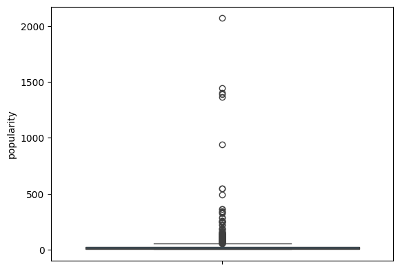
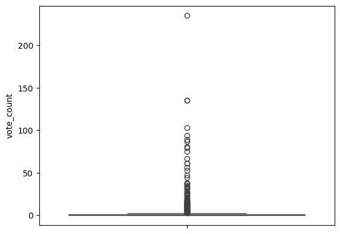
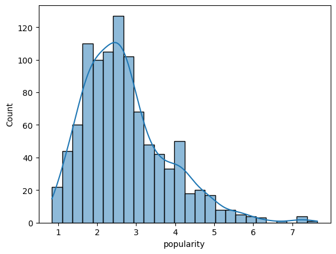
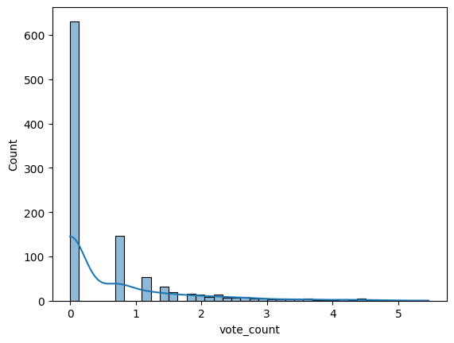
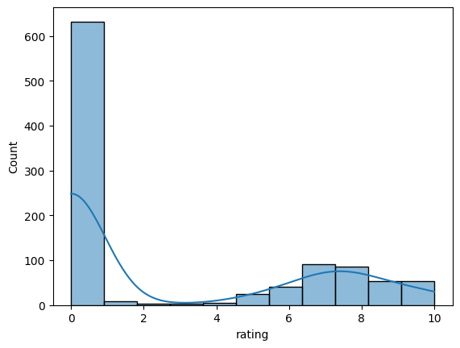
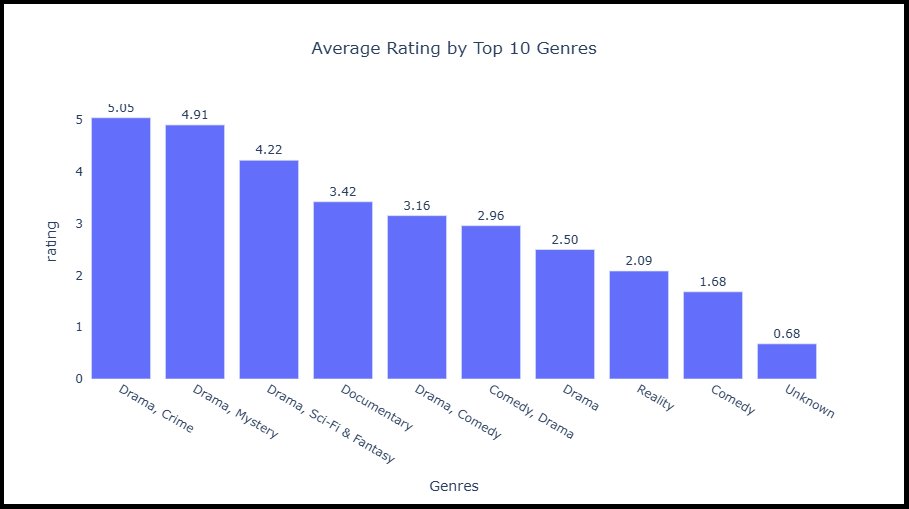
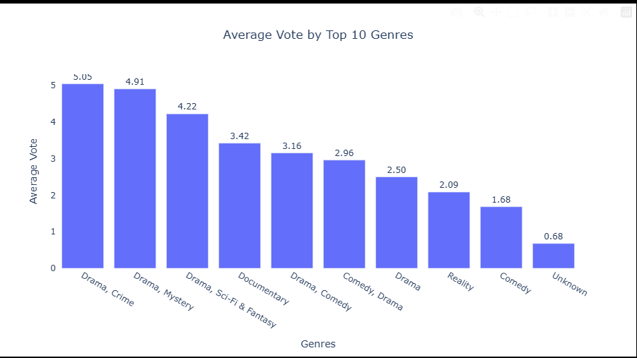

# Top Genres of Netflix Shows 2025

## Report and Conclusion

### Objective:
The goal of this project was to explore Netflix’s 2025 shows dataset and identify the top-performing genres based on multiple metrics:
* Rating
* Popularity
* Average Vote

### Methodology:

#### Data Collection:
Data was collected by Kaggle.

#### Data Cleaning and Preprocessing:
1. Handled Missing Values in genres and country
   
   Before Handling Missing Values:
   

   The Heatmap is showing that genres and country had the missing values

   After Handling Missing Values:
   

   #### Country:
   I imputed the country column using a dictionary of languages, and language column that is present in data.

```
# Example dictionary (you can expand it based on your dataset)
language_country_map = {
    'English': 'United States',
    'Hindi': 'India',
    'Spanish': 'Spain',  
    'French': 'France',
    'Japanese': 'Japan',
    'Korean': 'South Korea',
    'Mandarin': 'China',
    'German': 'Germany',
    'Italian': 'Italy',
    'Turkish': 'Turkey'
}
```
then filled missing entries with this dictionary

```
import numpy as np

# Fill missing 'country' using 'language' column

df['country'] = np.where(
    df['country'].isna(), 
    df['language'].map(language_country_map),  # map language to country
    df['country']  # keep existing country
)

# For any rows where country is still missing (language not in map), fill with "Unknown"

df['country'] = df['country'].fillna("Unknown")

```

#### genres:

I imputed genres by the help of title.

First i defined a dictionary of keywords related to genres

```
# Dictionary of keywords and their corresponding genres

keyword_genre_map = {
    'love': 'Romance',
    'romantic': 'Romance',
    'crime': 'Crime',
    'detective': 'Crime',
    'murder': 'Crime',
    'war': 'War',
    'battle': 'War',
    'science': 'Sci-Fi',
    'space': 'Sci-Fi',
    'alien': 'Sci-Fi',
    'comedy': 'Comedy',
    'funny': 'Comedy',
    'drama': 'Drama',
    'documentary': 'Documentary',
    'history': 'History',
    'biography': 'Documentary',
    'music': 'Music',
    'concert': 'Music',
    'horror': 'Horror',
    'thriller': 'Thriller',
    'adventure': 'Adventure',
    'fantasy': 'Fantasy',
    'superhero': 'Action',
    'action': 'Action'
}
```

then defined a function to assign genres using numpy


```
import numpy as np

def infer_genre_from_title(title): # defining a function
    if pd.isna(title): # if there is any missing row in title, so return "none"
        return None
    title_lower = title.lower() # convert entries of title in lower case
    for keyword, genre in keyword_genre_map.items(): # Loops through every keyword → genre pair in your keyword_genre_map dictionary.
        if keyword in title_lower: # if keyword is present then rturn genre
            return genre
    return None  # If no keyword matches
```

then i filled the missing genres using function

```
# Fill missing genres based on title

df['genres'] = np.where(
    df['genres'].isna(), # where genre is missing
    df['title'].apply(infer_genre_from_title), # apply the function on title 
    df['genres'] # and fill genres where it is missing
)

# If some still remain missing, fill them as "Unknown"

df['genres'] = df['genres'].fillna("Unknown")
```

2. Dealing with Outliers:

   #### Boxplot of Popularity:



   #### Boxplot of vote_count:

   

   The Boxplots of Popularity and Vote_count are showing that they have some outliers.

   I have come to the point that these high values are not the outliers but the real values of data (Real data of Netflix shows).
    They should not be removed.
    We can scaled the values to take insights from them by comparision methods.


3. Normalization/Scaling:
   
    The values of popularity and vote_counts are very high and very low. That is why the distribution is not normal but long tailed and right skewed.

    I applied the Log Transformation on Popularity and Vote_count.


#### Popularity Distribution:



#### Vote_count Distribution:



#### Rating Distribution:



 These plots are showing distribution after applying Log transformation

 I applied LOG on popularity.
 ```
# Normalizing the popularity using log transformation

df['popularity'] = np.log(df['popularity'])

df.head()
 ```

 
 I applied Log1p on popularity because the original values of vote_count are smaller.
 ```
# Normalizing the popularity using log transformation

df['vote_count'] = np.log1p(df['vote_count'])

df.head()
 ```

 ### Findings:

#### 1: I grouped top 10 genres in terms of Average rating.

#### The Barplot of Average rating of top 10 genres:



The Barplot is showing that the netflix shows whose genres are Crime, Drama is the genre that has highest ratings in 2025.
```
import plotly.express as px

# First, group and aggregate (Plotly needs summarized data for bar charts)

top_genres = df['genres'].value_counts().index[:10]
df_top = df[df['genres'].isin(top_genres)]

df_grouped = df_top.groupby('genres', as_index=False)['rating'].mean()

# Sort genres by mean vote_average for consistent order

df_grouped = df_grouped.sort_values('rating', ascending=False)

# Create bar plot

fig = px.bar(
    df_grouped,
    x='genres',
    y='rating',
    text='rating',  # Add labels on bars
    title='Average Rating by Top 10 Genres',
)

# Format labels and layout

fig.update_traces(
    texttemplate='%{text:.2f}',  # Format to 2 decimal places
    textposition='outside'
)

fig.update_layout(
    xaxis_title="Genres",
    yaxis_title="rating",
    xaxis={'categoryorder':'total descending'},
    plot_bgcolor='white',
    title_x=0.5,
    width=900,
    height=500
)

fig.show()

```

#### 2: I grouped top 10 genres in terms of Average Popularity.

#### The Barplot of Average popularity of top 10 genres:


The Barplot is showing that the netflix shows whose genres are Crime, Drama is the genre that has highest popularity in 2025.
```
import plotly.express as px

# First, group and aggregate (Plotly needs summarized data for bar charts)

top_genres = df['genres'].value_counts().index[:10]
df_top = df[df['genres'].isin(top_genres)]

df_grouped = df_top.groupby('genres', as_index=False)['popularity'].mean()

# Sort genres by mean vote_average for consistent order

df_grouped = df_grouped.sort_values('popularity', ascending=False)

# Create bar plot

fig = px.bar(
    df_grouped,
    x='genres',
    y='popularity',
    text='popularity',  # Add labels on bars
    title='Average Popularity by Top 10 Genres',
)

# Format labels and layout

fig.update_traces(
    texttemplate='%{text:.2f}',  # Format to 2 decimal places
    textposition='outside'
)

fig.update_layout(
    xaxis_title="Genres",
    yaxis_title="Popularity",
    xaxis={'categoryorder':'total descending'},
    plot_bgcolor='white',
    title_x=0.5,
    width=900,
    height=500
)

fig.show()
```

#### 3: I grouped top 10 genres in terms of vote_average.

#### The Barplot of vote_average of top 10 genres:



The Barplot is showing that the netflix shows whose genres are Crime, Drama is the genre that has highest vote_average in 2025.
```
import plotly.express as px

# First, group and aggregate (Plotly needs summarized data for bar charts)

top_genres = df['genres'].value_counts().index[:10]
df_top = df[df['genres'].isin(top_genres)]

df_grouped = df_top.groupby('genres', as_index=False)['vote_average'].mean()

# Sort genres by mean vote_average for consistent order

df_grouped = df_grouped.sort_values('vote_average', ascending=False)

# Create bar plot

fig = px.bar(
    df_grouped,
    x='genres',
    y='vote_average',
    text='vote_average',  # Add labels on bars
    title='Average Vote by Top 10 Genres',
)

# Format labels and layout

fig.update_traces(
    texttemplate='%{text:.2f}',  # Format to 2 decimal places
    textposition='outside'
)

fig.update_layout(
    xaxis_title="Genres",
    yaxis_title="Average Vote",
    xaxis={'categoryorder':'total descending'},
    plot_bgcolor='white',
    title_x=0.5,
    width=900,
    height=500
)

fig.show()
```


### Conclusion:

Drama and Crime are the leading Netflix genres of 2025, outperforming all others in terms of ratings, popularity, and audience engagement.
This suggests that Netflix users have a strong preference for emotionally engaging, suspenseful storytelling and character-driven narratives.

